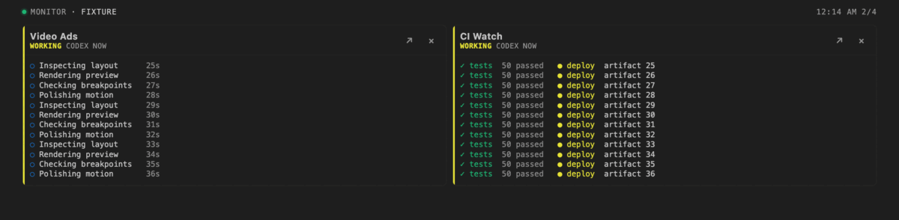

# AI Terminal Sessions

Agent workflows don't need another dashboard. Sometimes all you need is tabs. Trust me.

I keep Codex, Claude Code, servers, and CI jobs open in VS Code and move through them like browser tabs. This extension keeps those tabs alive and tells me which one needs attention.

[](https://code.visualstudio.com/)
[](#limits)
[](LICENSE)


## My workflow

- `Hyper+Left/Right` moves through terminal tabs.
- The title marker tells me when an agent needs me.
- `Hyper+Down` pins a server or CI watch in the Session Monitor.
- Reloading VS Code restores the same tabs, in the same order, with the same processes.



## Features

| Feature | Behavior |
|---|---|
| Persistent tabs | A private tmux session keeps each process alive across VS Code reloads and window closes |
| Cold restore | Codex and Claude resume from saved session IDs; generic commands return as tabs but are not run again |
| Status | Tab titles show working, permission, ready, error, and idle age |
| Session Monitor | Up to four ANSI-colored, auto-scrolling previews in a compact 2x2 window |
| Draft recovery | Saves the visible composer after 1.5 seconds and pastes it back without submitting; `Shift+Enter` and multiline paste still work |
| History | Restores horizontal order and keeps 20 workspace snapshots |
| Rename with AI | Uses the latest two useful messages to make a lowercase topic such as `video ads` or `auth solving` |
| Resize | Forwards VS Code dimensions to the PTY and tmux |

## Status markers

| Marker | Meaning |
|---|---|
| `○⠋` | Agent working |
| `🟠` | Waiting for permission or a tool |
| `🟢` | New answer ready |
| `🔴` | Interrupted or failed |
| `🟨` | Idle for less than 30 minutes |
| `🟧` | Idle for 30 minutes to 4 hours |
| `🟫` | Idle for more than 4 hours |

Green stays green until you return to the tab. After that, the idle colors age from yellow to brown based on real agent, command, or terminal activity.

## Install

This is a macOS preview. It needs VS Code 1.127 or newer and tmux 3.4 or newer. Building from source also needs Node.js 20.

### Tested setup

This started as a fix for my own workflow, and that is still the support boundary for this preview. I use it daily on an Apple Silicon Mac with macOS 26.5.2, VS Code 1.128.1, zsh 5.9, tmux 3.6a, Codex CLI, and Claude Code.

I have not tested Intel Macs, other operating systems, shells, terminal configurations, multiplexers, or agent harnesses. If your setup differs, expect rough edges and include versions plus a redacted log when [opening an issue](https://github.com/LEstradioto/ai-terminal-sessions/issues).

On another Mac, these are the things most likely to differ:

- `$SHELL` selects the login shell used when an agent is restored.
- `tmux`, `codex`, and `claude` are resolved from `PATH`. If a CLI works in Terminal.app but not here, set its absolute path in `aiTerminalSessions.executables`. Homebrew usually installs under `/opt/homebrew` on Apple Silicon and `/usr/local` on Intel.
- The private tmux server ignores `~/.tmux.conf`, so personal tmux bindings should not affect it.
- `defaultLocation` switches managed tabs between the editor and terminal panel.

```sh
brew install tmux
git clone https://github.com/LEstradioto/ai-terminal-sessions.git
cd ai-terminal-sessions
npm test
```

Open the repo in VS Code and press `F5`, or build a VSIX:

```sh
npx @vscode/vsce package
code --install-extension ai-terminal-sessions-0.4.4.vsix
```

Run **AI Sessions: Use as Default Terminal Profile** only if you want the terminal `+` button to create managed tabs. No extension startup ordering is required or configurable in VS Code.

## Shortcuts

| Action | Default | My setup |
|---|---:|---:|
| Pin active tab | `Cmd+Option+Down` | `Hyper+Down` |
| Toggle monitor | `Cmd+Option+Up` | `Hyper+Up` |
| Scroll tmux history | `Shift+Page Up/Down` | Same |
| Move between tabs | Your VS Code binding | `Hyper+Left/Right` |

"Hyper" is my macOS Hyper key mapped to `Cmd+Option`. The extension does not register it.
Keyboard scrolling enters tmux copy mode. Press `q` or `Escape` to return to the live terminal.

## Close and restore

| Action | Default behavior |
|---|---|
| Close a tab with X or a shortcut | Kill its private tmux session and forget the tab |
| Exit the shell cleanly | Forget the tab |
| Reload or close the VS Code window | Keep the process and restore the tab |
| Restart the machine | Resume saved Codex and Claude sessions; restore generic tabs without rerunning commands |

`closeBehavior` can change an explicit close to `forget` or `keep`. Failed tmux termination never drops recovery data. One VS Code window controls a workspace at a time.

## Rename, config, and privacy

Rename with AI only runs on command. The default `sameHarness` provider keeps Codex context in Codex and Claude context in Claude. `local` skips model calls; `vscode` uses a model provided by VS Code.

Other settings cover cold restore, editor or panel placement, drafts, monitor always-on-top, ready notifications, close behavior, and executable paths.

There is no telemetry or hosted service. State, drafts, and history stay local. Automatic polling does not send prompts to a model. The extension is disabled in untrusted and virtual workspaces. See [Data and privacy](docs/privacy.md) for the exact data flow and deletion steps.

Before uninstalling, run **AI Sessions: Stop All Managed Sessions**.

## Limits

- macOS only for now.
- One VS Code window per workspace.
- One tmux window and pane per tab.
- tmux owns scrollback inside managed tabs. Trackpad and mouse-wheel scrolling work, but the native VS Code terminal scrollbar does not represent tmux history.
- Generic processes survive VS Code restarts but not machine restarts.
- The floating always-on-top monitor uses optional VS Code workbench capabilities and can fall back to a regular editor.
- The PTY bridge uses the compatible `node-pty` bundled with the tested VS Code build.

See [Architecture](docs/architecture.md) and [Troubleshooting](docs/troubleshooting.md) for the internals and recovery commands.

## Development

There are no runtime npm dependencies.

```sh
npm run check
npm run test:coverage
```

The [demo](demo) uses fake transcripts and a fake Codex process. See [CONTRIBUTING.md](CONTRIBUTING.md) and [SECURITY.md](SECURITY.md) before sending code or logs.

## License

[MIT](LICENSE). Not affiliated with Microsoft, OpenAI, or Anthropic.
