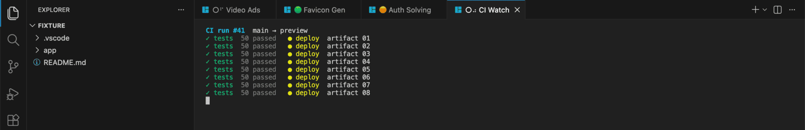
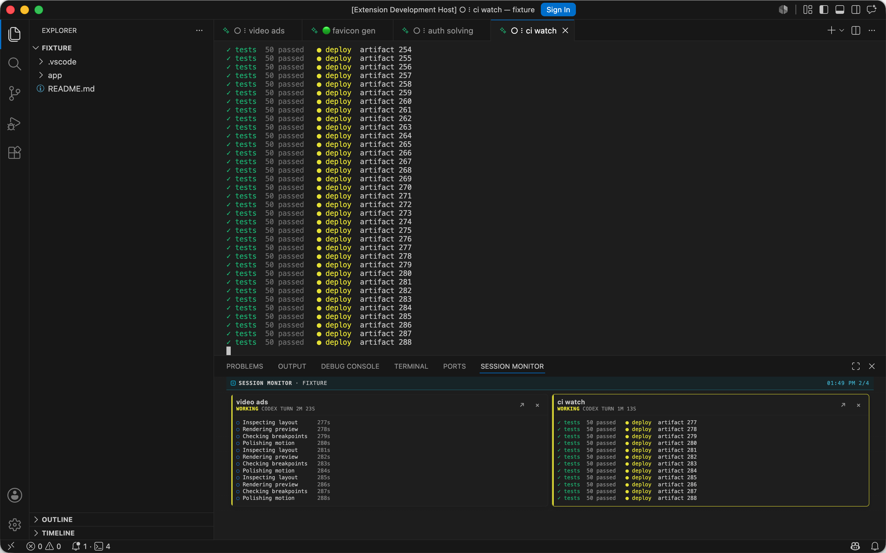

# AI Terminal Sessions

Agent workflows don't need another dashboard. Sometimes all you need is tabs.

Open a terminal the normal VS Code way, run Codex or Claude Code, and keep working. When you return to a workspace, the extension restores its tabs, names, order, and AI sessions.

[](https://code.visualstudio.com/)
[](#tested-setup)
[](LICENSE)

[](media/ai-terminal-sessions-demo.mp4)

*Ordinary VS Code terminal tabs, with workspace-aware names, order, restore, and status.*



*Pin up to four live sessions, watch ANSI output, turn time, and jump back with one click.*

[Watch the 46-second demo](media/ai-terminal-sessions-demo.mp4)

## Features

| Feature | What it does |
|---|---|
| Normal terminals | Open a terminal as usual, then run Codex or Claude Code |
| Workspace restore | Restores tabs, names, order, panes, and AI sessions after reloads or restarts |
| Live processes | Keeps terminals running when VS Code closes; after a computer restart, agents resume and other panes return as shells |
| Status and timing | Shows `○⠋` working, `🟠` permission, `🟢` ready until the next reply, `🔴` interrupted, idle age colors `🟨` → `🟧` → `🟫`, and per-prompt turn time |
| Session Monitor | Pins four ANSI-colored, auto-scrolling previews in the native bottom panel |
| Recovery | Autosaves the visible draft and restores closed tabs one at a time from local history |
| Panes | Restores layout, directory, focus, and agent sessions for helpers such as servers, logs, tests, or CI |
| Labels and terminal UX | Adds short lowercase names, process icons, 20,000-line history, resize, `Shift+Enter`, multiline paste, and tmux copy mode |

```text
Workspace
└── VS Code tab
    └── private tmux session
        ├── Codex or Claude pane
        └── optional server, logs, tests, or CI panes
```

## Install

This is a macOS preview. It needs VS Code 1.127 or newer, tmux 3.4 or newer, and Node.js 20 when building from source.

It is not published to the Visual Studio Marketplace yet. I want more daily use behind the restore and recovery paths before doing that.

```sh
brew install tmux
git clone https://github.com/LEstradioto/ai-terminal-sessions.git
cd ai-terminal-sessions
npm test
```

Open the repo in VS Code and press `F5`, or build a local VSIX:

```sh
npx @vscode/vsce package
code --install-extension ai-terminal-sessions-0.6.0.vsix
```

Open **AI Sessions: More Actions...** and choose **Use as default terminal profile** only if you want the terminal `+` button to create managed tabs.

### Tested setup

I use this daily on an Apple Silicon Mac with macOS 26.5.2, VS Code 1.128.1, zsh 5.9, tmux 3.6a, Codex CLI, and Claude Code.

I have not tested Intel Macs, other operating systems, shells, terminal configurations, multiplexers, or agent harnesses. If your setup differs, expect rough edges and include versions plus a redacted log when [opening an issue](https://github.com/LEstradioto/ai-terminal-sessions/issues).

`tmux`, `codex`, and `claude` are resolved from `PATH`. Set absolute paths in `aiTerminalSessions.executables` when a CLI works in Terminal.app but not in VS Code. The private tmux server ignores `~/.tmux.conf`, so personal bindings do not leak into managed tabs.

## Shortcuts and tmux

| Action | Default | My setup |
|---|---:|---:|
| Pin active tab | `Cmd+Option+Down` | `Hyper+Down` |
| Focus or toggle monitor | `Cmd+Option+Up` | `Hyper+Up` |
| Scroll tmux history | `Shift+Page Up/Down` | Same |
| Move between tabs | Your VS Code binding | `Hyper+Left/Right` |

"Hyper" is my macOS Hyper key mapped to `Cmd+Option`. The extension does not register it.

On a MacBook, `Page Up/Down` is `Fn+Up/Down`, so keyboard scrolling is `Shift+Fn+Up/Down`. The mouse wheel uses tmux history in Codex and regular shells, but stays with Claude Code's own scroll UI inside Claude. The keyboard shortcut always opens tmux history.

Click and drag selects text, copies it to the macOS clipboard on release, and immediately returns to live output. Empty selections leave the existing clipboard untouched. Double click copies one word. Keyboard selection uses `v`, arrow keys, and `y` to copy. While scrollback or keyboard copy mode is active, the status bar shows **Jump to bottom**. Click it, or press `q` or `Escape`, to return to live output.

The monitor shortcut opens and focuses the panel, or closes it when the monitor already has focus. Use the arrow keys to move through cards, `Enter` to open the selected session, and `Escape` to return to the previous terminal without closing the monitor.

Common commands such as rename, session switching, and pane actions are directly available from the Command Palette. Right click inside a managed terminal for tab-specific actions such as icon, draft recovery, monitor pinning, pane role, and removal. Rare recovery and maintenance commands stay in one flat **AI Sessions: More Actions...** list.

Each tab keeps the standard tmux prefix, `Ctrl+B`. Useful follow-up keys are `%` to split right, `"` to split down, arrow keys to change pane, `o` for the next pane, `z` to zoom, `x` to close, `[` for scrollback, and `?` for the full list. The terminal context menu exposes the same pane actions while you learn the bindings.

## Close, restore, and history

| Action | Default behavior |
|---|---|
| Close a tab with X or a shortcut | Kill its private tmux session and remove the live tab |
| Exit the shell cleanly | Remove the live tab |
| Reload or close the VS Code window | Keep the process and restore the tab |
| Restart the machine | Resume saved Codex and Claude sessions; restore generic tabs as shells |

Explicitly closed tabs stay in **Session History**. Browse the local preview and press `Enter` to restore one tab. Snapshot recovery remains available as an advanced fallback and warns before adding several tabs.

Before moving a workspace to another disk, use **Prepare workspace move...**. The extension saves recovery data, stops managed processes, and provides a matching import action for the new path. See [Troubleshooting](docs/troubleshooting.md#moving-a-workspace-to-another-disk) for the full sequence.

## Config and privacy

The public settings cover close behavior, cold restore, editor or panel placement, drafts, notifications, and executable paths. The defaults are meant to work without setup.

There is no telemetry or hosted service. State, drafts, previews, and history stay local. **Rename with AI** runs only when requested and sends at most two recent user messages to the selected Codex, Claude, or VS Code provider. Choose the deterministic `local` provider to avoid model calls.

The extension reads local Codex and Claude metadata to restore sessions and derive status. See [Data and privacy](docs/privacy.md) for the exact data flow and deletion steps.

Before uninstalling, choose **AI Sessions: More Actions...**, then **Stop all managed sessions...**.

## Limits

- macOS only for now.
- One VS Code window controls a workspace at a time.
- One tmux session and one tmux window belong to each tab. A tab may contain several panes.
- tmux owns managed scrollback, so the native VS Code scrollbar does not represent its history.
- Generic processes survive VS Code restarts but not machine restarts or a prepared workspace move. Their panes return as shells and commands are not rerun.
- Session Monitor lives in VS Code's native bottom panel beside Problems, Output, and Terminal.
- macOS can attribute access from a long-lived terminal child process to VS Code. If the repeated "access data from other apps" prompt appears, inspect the responsible binary before granting broader permissions. See [Troubleshooting](docs/troubleshooting.md#macos-keeps-asking-to-access-data-from-other-apps).
- The PTY bridge uses the compatible `node-pty` bundled with the tested VS Code build.

See [Architecture](docs/architecture.md) for the internals.

## Development

There are no runtime npm dependencies.

```sh
npm run check
npm run test:coverage
```

The [demo](demo) uses fake transcripts and a fake Codex process. Read [CONTRIBUTING.md](CONTRIBUTING.md) and [SECURITY.md](SECURITY.md) before sending code or logs.

## License

[MIT](LICENSE). Not affiliated with Microsoft, OpenAI, or Anthropic.
